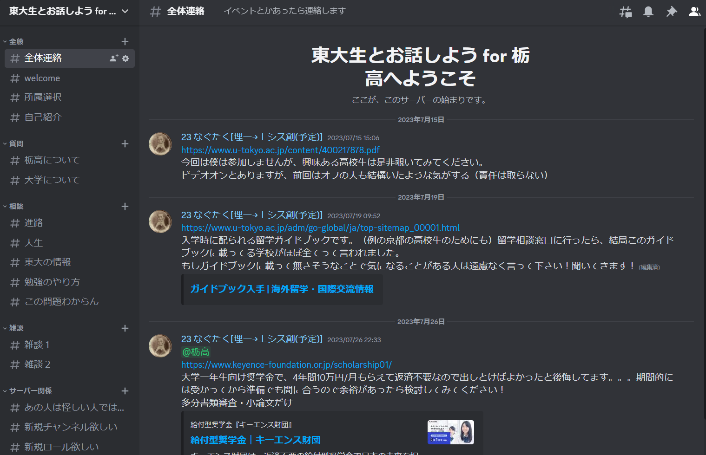
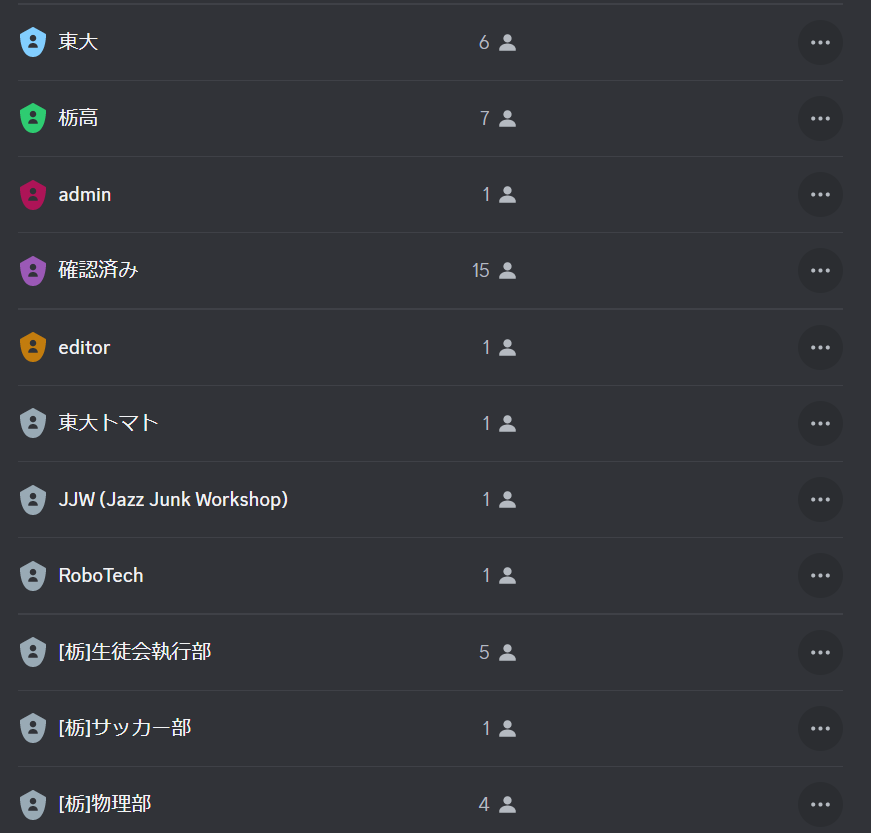

% 東大生とお話しよう for 栃高
% taktstock
% 2023-09-10

# 東大生とお話しよう for 栃高
このページは、Discordサーバー「東大生とお話しよう for 栃高」のエントランスページです。
## 畢竟どんなサーバー？
基本何をしてもOK！東大生をもっと身近に感じて欲しい〜！

大学のリアルを解像度高く得られる（かもしれない）し、おもろい情報が流れてくる（かもしれない）し、受験のモチベ維持になる（かもしれない）し、色んな人と知り合える（かもしれない）！

### サーバーの様子
新しくチャンネルを作ってほしい等の要望があれば遠慮なく`@admin`または`@editor`に連絡してください。

### Current Server Status
<html>
<iframe src="https://discord.com/widget?id=1124713846368632933&theme=dark" width="350" height="400" allowtransparency="true" frameborder="0" sandbox="allow-popups allow-popups-to-escape-sandbox allow-same-origin allow-scripts"></iframe>
</html>

## Steps to Join
1. [Discord](https://discord.com/register)のアカウントを作る

1. [ここ](https://discord.gg/bYfEKtDue2)をクリックしてサーバーに参加

1. ウェルカムメッセージに従ってロール選択（部活とか）と表示名を変更
 *以下のようにロールで所属が分かるようにしてます* 

1. 自己紹介はやりたかったらする
 *できたらしてほしい* 

1. 運営が承認してくれるのを待つ
 *承認済みになると全てのチャンネルが見えるようになります*
------
------

## なぜ作ったのか
あるイベントで京都の高校３年生と出会い、後日その高校出身の友達を経由して連絡が来て、それがきっかけで東大の留学や研究室の情報を調べてあげていた。ネットでもある程度の情報は手に入るが、学内の方が調べやすい情報も多いのだ。

私は高校のときに情報が無さすぎて困ったため、今の私のような先輩が居たら良かったなーと思い、またこの先私と同じように困る人が少なくなるようにと思ってこのサーバーを立ち上げた。有名進学校に情報やコネ（健全な意味の）が偏っている現状が少しでも改善されることを願う。

##  注意事項
### 重要
* このサーバーは**種々の相談場所/モチベ維持の材料/進路決定の助け/縦横の繋がりのきっかけ**となることを想定していますが、どのように活用しても構いません。
* 逆に**特定の大学への進学を強く推奨することはこのサーバーの目的ではありません**。
* ニックネームでの参加可ですが、入学年と所属情報（部活とか）はなるべく明記してください。
* このサーバーを起因とするトラブルに対し、当事者以外のサーバー参加者は**一切責任を負いません**。
* サーバーの性質上内容に個人情報が含まれる可能性があります。**取り扱いには注意**しましょう。
* 運営側も試行錯誤で進めています。ご意見あれば忌憚なく教えてください。
### その他
* 大学入学年が同じでも高校卒業年が違うことは往々にしてあります。気まずくならないように注意しましょう。
* このサーバーではデフォルトで`@mention`でしか通知が飛ばないようになってます。
* いつでも無言で抜けて構いません。
* 栃高生/東大生/栃高卒浪人生なら誰でも招待して構いません。東大を一切志望していなくても、です。
* 栃高の先生や他大生の参加も検討中ですが、そうなったときは`#全体連絡`します。
* 喋る内容も一切制限しません。進路相談でも**恋愛相談でも**どうぞ。ただしセンシティブなコンテンツは忠告なしに削除することがあります。

## 運営ロールについて
このサーバーには`@admin`と`@editor`という二つの運営ロールがあります。その名の通り`@admin`はほぼ全ての権限を持ち、`@editor`はチャンネルやロールの新規追加/編集の権限のみを持ちます。

運営側も常に人員を募集しています！興味があれば`@admin`に連絡してください。

# Join us!
ここまで読んでくれてありがとう。少しでも興味を持ったら一歩踏み出してみよう！

<html>

<a href="https://discord.gg/bYfEKtDue2" class="buttonOutlineGradient">
    JOIN
</a>
</html>

> All life is an experiment. The more experiments you make the better. ― Ralph Waldo Emerson